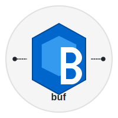
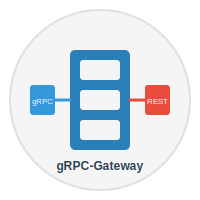

### Hi there, I'm Sanjib Devnath 👋

I'm a software developer passionate about designing and building applications with diverse technologies. I'm driven by a continuous learning mindset and enjoy experimenting with cutting-edge tech!

[][linkedin]

 

## 🛠️ Skills & Technologies

### Programming Languages
[][python]
[][java]
[][golang]
[][javascript]
[][php]
[][typescript]

 
 

### Web & Application Frameworks
[][nodejs]
[][express]
[][laravel]
[][flask]
[][spring]
[][socketio]
[][gin]

 
 

### API & RPC Frameworks
[][grpc]
[][protobuf]
[][buf]
[][grpc-gateway]
[][twirp]

 
 

### SQL Databases
[][mysql]
[][plsql]
[][tidb]
[][trino]

 
 

### NoSQL & Graph Databases
[][mongodb]
[][gremlin]
[][neo4j]
[][arangodb]
[][redis]
[][dynamodb]
[][cassandra]

 
 

### Search & Messaging
[][elasticsearch]
[][kafka]
[][sqs]
[][sns]
[][opensearch]

 
 

### Version Control & CI/CD
[][git]
[][argocd]

 
 

### Cloud & Infrastructure
[][aws]
[][terraform]
[][docker]
[][kubernetes]

 
 

### Monitoring & Observability
[][prometheus]
[][grafana]

 
 

### Development Tools & IDE
[][vscode]
[][phpstrom]
[][pycharm]
[][intellij]
[][goland]
[][cursor]
[][copilot]

 
 

### AI & LLM Frameworks
[][langchain]

 
 

### Operating Systems
[][ubuntu]
[][macos]
[][windows]

 
 

---

---

---

### 📺 Latest Interesting YouTube Videos

<!-- YOUTUBE:START -->
- [Google’s Genie model makes realistic worlds in realtime…](https://www.youtube.com/watch?v=0XvOOi6g5Ok)
- [Gödel&#39;s Incompleteness Theorem - Computerphile](https://www.youtube.com/watch?v=IuX8QMgy4qE)
- [Do the Rich Deserve Their Wealth? Exploring the Case for Luck Insurance](https://www.youtube.com/watch?v=dz2vRqxf0HI)
- [The dating app that doxxed 72,000 women...](https://www.youtube.com/watch?v=miTpJmMt7uo)
- [Writing a Text Editor - Computerphile](https://www.youtube.com/watch?v=g2hiVp6oPZc)
<!-- YOUTUBE:END -->

---

### 📕 Latest interesting Blog Posts

<!-- BLOG-POST-LIST:START -->
- [Astronomers use starlight to measure greenhouse gases in Earth&#39;s atmosphere](https://www.space.com/astronomy/astronomers-use-starlight-to-measure-greenhouse-gases-in-earths-atmosphere)
- [AI agents aren’t the ‘new Google,’ says Airbnb CEO](https://techcrunch.com/2025/08/07/ai-agents-arent-the-new-google-says-airbnb-ceo/)
- [The backlash against Duolingo going ‘AI-first’ didn’t even matter](https://techcrunch.com/2025/08/07/the-backlash-against-duolingo-going-ai-first-didnt-even-matter/)
- [James Webb Space Telescope spots a potential new exoplanet just 4 light-years away from Earth](https://www.space.com/astronomy/exoplanets/james-webb-space-telescope-spots-a-potential-new-exoplanet-just-4-light-years-away-from-earth)
- [Elon Musk says X plans to introduce ads in Grok’s responses](https://techcrunch.com/2025/08/07/elon-musk-says-x-plans-to-introduce-ads-in-groks-responses/)
<!-- BLOG-POST-LIST:END -->

---

[linkedin]: https://linkedin.com/in/sanjib-devnath-76a55642
[vscode]: https://code.visualstudio.com/
[javascript]: https://www.w3schools.com/js/DEFAULT.asp
[nodejs]: https://nodejs.org/en/
[mongodb]: https://www.mongodb.com/
[gremlin]: https://tinkerpop.apache.org/
[java]: https://www.java.com/en/
[php]: https://www.php.net/
[golang]: https://go.dev/
[typescript]: https://www.typescriptlang.org/
[mysql]: https://www.mysql.com/
[neo4j]: https://neo4j.com/
[arangodb]: https://www.arangodb.com/
[ubuntu]: https://ubuntu.com/
[phpstrom]: https://www.jetbrains.com/phpstorm/
[intellij]: https://www.jetbrains.com/idea/
[pycharm]: https://www.jetbrains.com/pycharm/
[goland]: https://www.jetbrains.com/go/
[kubernetes]: https://kubernetes.io/
[terraform]: https://www.terraform.io/
[laravel]: https://laravel.com/
[express]: https://expressjs.com/
[flask]: https://flask.palletsprojects.com/en/2.0.x/
[python]: https://www.python.org/
[spring]: https://spring.io/projects/spring-boot
[redis]: https://redis.io/
[docker]: https://www.docker.com/
[aws]: https://aws.amazon.com/
[socketIO]: https://socket.io/
[kafka]: https://kafka.apache.org/
[plsql]: https://www.postgresql.org/
[git]: https://git-scm.com/
[elasticsearch]: https://www.elastic.co/elasticsearch/
[kibana]: https://www.elastic.co/kibana/

[langchain]: https://www.langchain.com/
[prometheus]: https://prometheus.io/
[grafana]: https://grafana.com/
[argocd]: https://argo-cd.readthedocs.io/
[cursor]: https://cursor.sh/
[copilot]: https://github.com/features/copilot
[gin]: https://gin-gonic.com/
[grpc]: https://grpc.io/
[protobuf]: https://developers.google.com/protocol-buffers
[buf]: https://buf.build/
[grpc-gateway]: https://github.com/grpc-ecosystem/grpc-gateway
[twirp]: https://github.com/twitchtv/twirp
[tidb]: https://pingcap.com/tidb/
[trino]: https://trino.io/
[dynamodb]: https://aws.amazon.com/dynamodb/
[cassandra]: https://cassandra.apache.org/
[sqs]: https://aws.amazon.com/sqs/
[sns]: https://aws.amazon.com/sns/
[opensearch]: https://opensearch.org/
[macos]: https://www.apple.com/macos/
[windows]: https://www.microsoft.com/windows/
